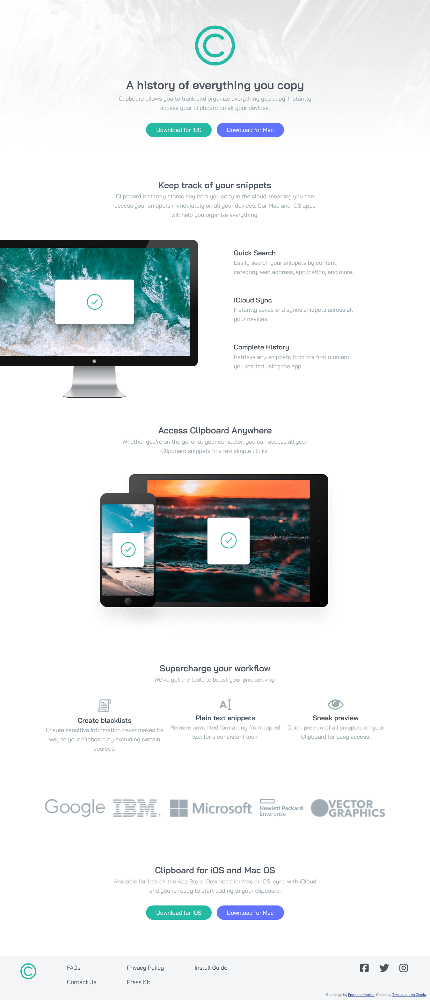

# Frontend Mentor - Clipboard landing page solution

This is a solution to the [Clipboard landing page challenge on Frontend Mentor](https://www.frontendmentor.io/challenges/clipboard-landing-page-5cc9bccd6c4c91111378ecb9). Frontend Mentor challenges help you improve your coding skills by building realistic projects. 

## Table of contents

- [Overview](#overview)
  - [The challenge](#the-challenge)
  - [Screenshot](#screenshot)
  - [Links](#links)
- [My process](#my-process)
  - [Built with](#built-with)
  - [What I learned](#what-i-learned)
  - [Continued development](#continued-development)
  - [Useful resources](#useful-resources)
- [Author](#author)
- [Acknowledgments](#acknowledgments)

## Overview
I am currently taking a course in Frontend Development, and this project was given as an assignment. So, let's dive right in.

### The challenge

Users should be able to:

- View the optimal layout for the site depending on their device's screen size
- See hover states for all interactive elements on the page

### Screenshot




### Links

- Solution URL: [My Solution URL](https://github.com/Tiwalolaoluwa-Olaolu/Tiwa-s-Version-Clipboard)

## My process
After critically examining and inspecting the designs (both desktop and mobile), I was able to decide on the coding approach I wanted to employ for this particular website. Then the next step was to begin coding the solution for the designs, and making them responsive for ALL screen sizes.

### Built with

- Semantic HTML5 markup
- CSS styling
- CSS Custom Properties
- Flexbox

### What I learned

I learnt that all website are designed uniquely. As such, developing different websites do not follow the same coding techniques. A particular coding technique applied to create a certain website may not be a smart approach to developing another. Therefore, understanding the web designs is a major determining factor on the most accurate and clean approach to utilize.

Snippet of codes that made me proud, not necessarily because of its complexity but because it displays my creativity.

```html
<div class="btn-container">
  <a class="download-btn download-btn-iOS" href="download-iOS.html">Download for iOS</a>
  <a class="download-btn download-btn-Mac" href="download-Mac.html">Download for Mac</a>
</div>
```

I was able to make the buttons for the Clipboard page active as I created a separate page (still following the design structure of the Clipboard landing page) that made the Clipboard page a more active and engaging website, rather than just a dormant one. This made me so proud!

### Continued development

In the future, I would like to make use of CSS Grids to develop a responsive design. Flexbox is just ONE way; it is not the only approach to coding all websites.

### Useful resources

- [W3Schools](https://www.w3schools.com) - The best part about web development is that there are several resources on the internet. I like tackling most challenges myself as it makes me proud to do so, but when I'm completely stuck, this has proven useful on most occassions.

## Author
I am Tiwalolaoluwa Olaolu, a frontend developer trainee looking to refine her skills and knowledge in programming.

## Acknowledgments

I would like to appreciate Mr. Stanley of Techjaunty for always pushing me and tasking me. Like his love for practical assignment shows, "Practice even while learning. Why wait till the learning process is over?"

